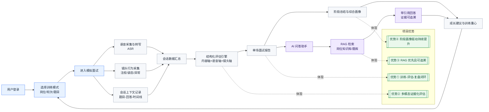
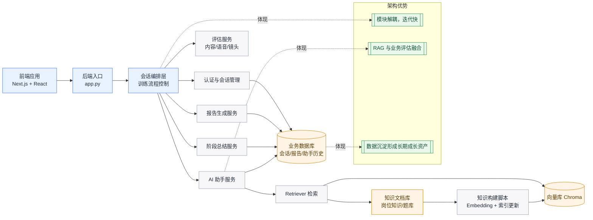

# 职跃星辰 流程图（中文版 Mermaid，中等比例版）

这版是中等比例（不过宽、不过高），适合放在 16:9 PPT 的主体区域。  
重点突出：训练闭环、多模态评估、RAG 可追溯、阶段画像驱动提升。

---

## 1）项目主流程（中等比例）

---

## 2）技术架构流程（中等比例）

---

## 3）PPT 讲解词（约 90 秒）

这张图展示的是 职跃星辰 的完整训练闭环。用户先选择岗位、轮次和题目进入模拟面试，系统会同步采集语音、镜头行为和会话上下文，然后通过结构化评估引擎生成单场报告。

报告不是只给一个总分，而是告诉用户具体短板在哪里、证据来自哪里。接下来系统会把最近多场结果聚合成阶段画像，判断用户当前是上升、波动还是某些能力反复卡住，并给出下一轮训练重心。  

更关键的是，用户可以基于报告里的薄弱点直接进入 AI 助手继续追问，比如“系统设计回答怎么更有层次”。助手会先检索知识库，再结合当前会话给出答案，并展示引用来源。这样用户拿到的不只是建议，而是可以立即执行的训练动作，最终回流到下一轮训练，形成“发现问题—理解问题—执行改进—再次验证”的持续提升闭环。

