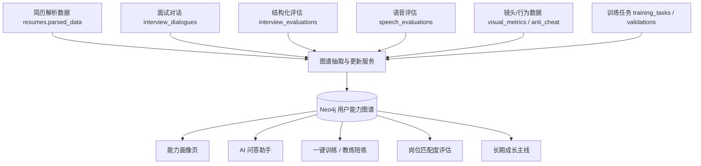
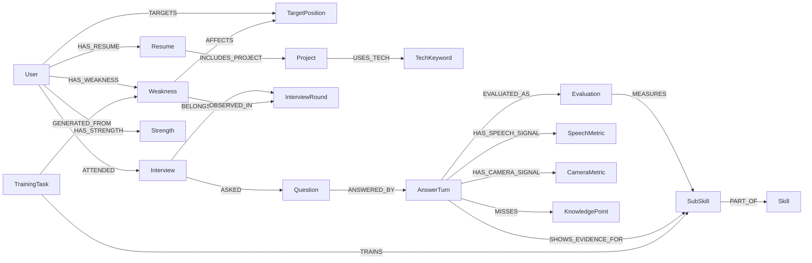
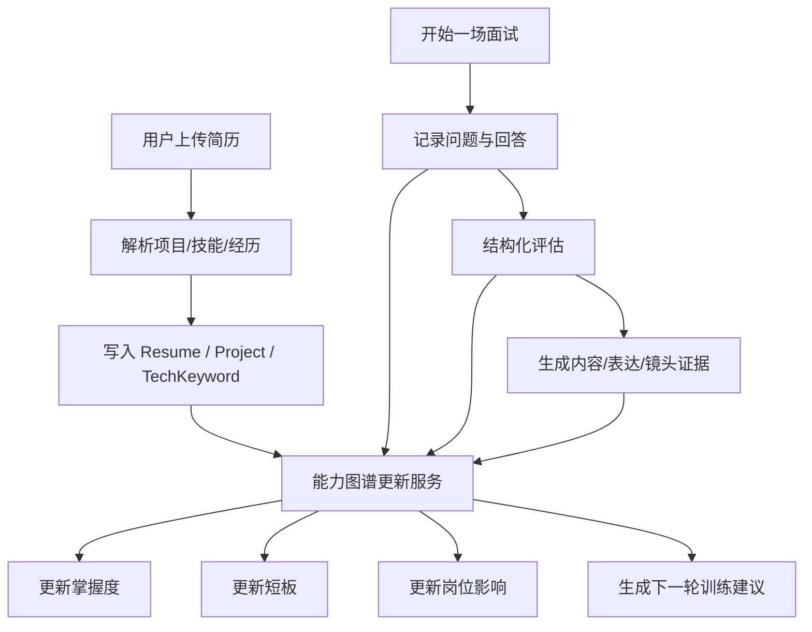

# 职跃星辰 用户能力知识图谱设计图

## 1. 设计目标

这版知识图谱不是做“通用世界知识图谱”，而是做 **以用户为中心的能力知识图谱**。

核心目标有 4 个：

1. 让系统持续理解用户“会什么、不会什么、稳定到什么程度”。
2. 让每场面试对话、评分报告、简历解析结果都能沉淀为结构化能力证据。
3. 让用户能可视化看到自己的知识能力图谱，而不是只看到一堆分数。
4. 让图谱反过来驱动个性化训练、复盘建议、岗位匹配度和一键训练闭环。

---

## 2. 从 llm-graph-builder-main 借鉴什么

结合 `llm-graph-builder-main` 源码，它最值得借鉴的是 4 个能力：

1. **结构化抽取能力**
   - 它的 `schema_extraction.py` 说明它支持先抽“节点类型 + 关系类型”，再把非结构化文本转成图结构。

2. **Neo4j 存储与查询能力**
   - 它的 `graph_query.py` 展示了 Neo4j 节点、关系、属性的标准查询和图结果封装方式。

3. **图谱可视化能力**
   - 它的 `GraphViewModal.tsx` 使用图可视化组件对节点和关系进行交互展示，这一层很适合迁移思路到 职跃星辰。

4. **图谱问答 / 检索增强能力**
   - 它不仅把文档变成图，还支持基于图结构做问答，这一点适合后续扩展到“基于用户能力图谱做训练推荐”。

但是 职跃星辰 不应该照搬它的“文档知识图谱”模式，而应该改造成：

**面试对话 + 报告 + 简历 + 历史训练 -> 用户能力知识图谱**

---

## 3. 职跃星辰 适配后的总图

---

## 4. 图谱建模原则

### 4.1 核心原则

1. **以用户为中心**
   - 所有知识点、短板、项目经历、证据片段都围绕某个用户组织。

2. **证据驱动**
   - 图谱里每一个“掌握 / 不足 / 建议”都尽量能追溯到某场面试、某个题目、某段回答、某次评分。

3. **轮次感知**
   - 技术面、项目面、系统设计面、HR 面应有不同的能力映射，而不是一套规则通吃。

4. **可回流训练**
   - 图谱不是静态展示，而是要参与下一轮训练出题和建议生成。

---

## 5. 节点设计

### 5.1 用户与目标层

| 节点类型 | 说明 | 主要来源 |
|---|---|---|
| `User` | 当前用户 | `users` |
| `TargetPosition` | 用户目标岗位，如 Java 后端、前端、算法 | 设置、训练配置、面试轮次推断 |
| `InterviewRound` | 技术面、项目面、系统设计面、HR 面 | `interview_evaluations.round_type` |
| `TrainingPlan` | 周计划/训练计划 | `training_week_plans` |
| `TrainingTask` | 一键训练或周计划内的训练任务 | `training_tasks` |

### 5.2 简历与经历层

| 节点类型 | 说明 | 主要来源 |
|---|---|---|
| `Resume` | 某一版简历 | `resumes` |
| `Project` | 简历项目 | `resumes.parsed_data.projects` |
| `Experience` | 工作/实习经历 | `resumes.parsed_data.experiences` |
| `TechKeyword` | 技术关键词，如 Redis、Spring Boot、React | 简历解析 + 题目 + 回答 |

### 5.3 能力与知识层

| 节点类型 | 说明 | 主要来源 |
|---|---|---|
| `Skill` | 一级能力，如 后端基础、系统设计、表达组织 | 自定义能力树 |
| `SubSkill` | 二级能力，如 缓存一致性、容量预估、STAR 表达 | 题库 / RAG / 评估维度 |
| `KnowledgePoint` | 更细颗粒度知识点 | 题库、RAG 文档、面试问答 |
| `Weakness` | 反复暴露的主短板 | insights / 报告聚合 |
| `Strength` | 已形成优势的稳定能力 | 多场高分证据聚合 |

### 5.4 面试证据层

| 节点类型 | 说明 | 主要来源 |
|---|---|---|
| `Interview` | 一场完整面试 | `interviews` |
| `Question` | 某道问题 | `interview_dialogues` / 题库 / RAG |
| `AnswerTurn` | 用户某次回答 | `interview_dialogues` |
| `Evaluation` | 某题或某轮评估结果 | `interview_evaluations` |
| `SpeechMetric` | 语音表达指标 | `speech_evaluations` |
| `CameraMetric` | 镜头 / 姿态 / 注视 / 心率等行为指标 | `interview_visual_metrics`、report 聚合 |
| `EvidenceSnippet` | 可回放的证据片段 | 回答摘录、报告说明、追问文本 |

---

## 6. 关系设计

下面是第一版最关键的关系。

| 关系 | 含义 |
|---|---|
| `(:User)-[:TARGETS]->(:TargetPosition)` | 用户目标岗位 |
| `(:User)-[:HAS_RESUME]->(:Resume)` | 用户拥有某版简历 |
| `(:Resume)-[:INCLUDES_PROJECT]->(:Project)` | 简历包含项目 |
| `(:Project)-[:USES_TECH]->(:TechKeyword)` | 项目使用的技术 |
| `(:User)-[:ATTENDED]->(:Interview)` | 用户参与某场面试 |
| `(:Interview)-[:BELONGS_TO_ROUND]->(:InterviewRound)` | 面试所属轮次 |
| `(:Interview)-[:ASKED]->(:Question)` | 面试包含问题 |
| `(:Question)-[:ANSWERED_BY]->(:AnswerTurn)` | 问题对应回答 |
| `(:AnswerTurn)-[:EVALUATED_AS]->(:Evaluation)` | 回答对应评估 |
| `(:Evaluation)-[:MEASURES]->(:SubSkill)` | 该评估测量了某个子能力 |
| `(:SubSkill)-[:PART_OF]->(:Skill)` | 子能力属于一级能力 |
| `(:AnswerTurn)-[:SHOWS_EVIDENCE_FOR]->(:SubSkill)` | 回答体现了某个能力点 |
| `(:AnswerTurn)-[:MISSES]->(:KnowledgePoint)` | 回答缺失某个知识点 |
| `(:Weakness)-[:AFFECTS]->(:TargetPosition)` | 该短板影响哪些岗位 |
| `(:Weakness)-[:OBSERVED_IN]->(:InterviewRound)` | 短板主要暴露在哪些轮次 |
| `(:TrainingTask)-[:TRAINS]->(:SubSkill)` | 训练任务针对哪个能力点 |
| `(:TrainingTask)-[:GENERATED_FROM]->(:Weakness)` | 任务来自哪个短板 |
| `(:User)-[:HAS_STRENGTH]->(:Strength)` | 用户已形成的强项 |
| `(:User)-[:HAS_WEAKNESS]->(:Weakness)` | 用户当前短板 |

---

## 7. 第一版能力图谱主结构

---

## 8. 与 职跃星辰 当前数据库的映射

这部分是最重要的，因为它决定这套图谱能不能直接接到你现有项目里。

### 8.1 可以直接作为图谱输入的数据表

| 现有表 / 数据 | 图谱用途 |
|---|---|
| `users` | `User` 节点 |
| `resumes` + `parsed_data` | `Resume`、`Project`、`Experience`、`TechKeyword` |
| `interviews` | `Interview` 节点 |
| `interview_dialogues` | `Question`、`AnswerTurn`、`EvidenceSnippet` |
| `interview_evaluations` | `Evaluation`、能力分数、岗位匹配度、轮次 |
| `speech_evaluations` | `SpeechMetric` |
| `interview_visual_metrics` / `camera_insights` | `CameraMetric` |
| `training_week_plans` | `TrainingPlan` |
| `training_tasks` / `training_task_validations` | `TrainingTask`、验证结果 |
| insights 聚合结果 | `Weakness`、`Strength`、长期趋势、岗位匹配影响 |

### 8.2 现有后端里已经能提供的关键特征

从你现在代码里，已经能提出来这些图谱信号：

1. `resume_data`
   - 简历技能
   - 项目经历
   - 工作经历

2. `current_question`
   - 当前被问到的问题文本

3. `overall_score / job_match_score`
   - 总分和岗位匹配度

4. `content_performance.weak_dimensions`
   - 内容层弱项

5. `speech_performance`
   - 表达清晰、语速、流畅度、停顿等

6. `camera_performance / camera_insights`
   - 镜头状态、注视、姿态、心率趋势等

7. `training_mode / training_tasks`
   - 当前训练模式和训练目标

这说明：**你的项目已经具备构图的数据基础，不需要从零开始。**

---

## 9. 图谱更新流程

---

## 10. 推荐的 Neo4j 第一版 Schema

### 10.1 节点属性建议

#### `User`
- `user_id`
- `display_name`
- `target_position`
- `created_at`

#### `Project`
- `project_id`
- `name`
- `summary`
- `source_resume_id`

#### `SubSkill`
- `skill_key`
- `label`
- `category`
- `round_scope`

#### `Question`
- `question_id`
- `content`
- `round_type`
- `source_type`
- `difficulty`

#### `AnswerTurn`
- `turn_id`
- `content`
- `created_at`
- `interview_id`

#### `Evaluation`
- `evaluation_id`
- `overall_score`
- `job_match_score`
- `round_type`
- `confidence`

#### `Weakness`
- `weakness_key`
- `label`
- `frequency`
- `severity`
- `last_seen_at`

### 10.2 关系属性建议

#### `SHOWS_EVIDENCE_FOR`
- `score`
- `confidence`
- `source`
- `turn_id`

#### `MISSES`
- `severity`
- `reason`
- `source_turn_id`

#### `GENERATED_FROM`
- `source_type`
- `created_at`

---

## 11. 面向前端的可视化设计

不建议第一版就做成一个完全自由的通用图谱工作台。更适合 职跃星辰 的是 3 个视图：

### 11.1 总览图谱

用户打开“知识图谱”页时默认看到：

- 中心节点：当前用户
- 第一圈：目标岗位、当前强项、当前短板、主要项目
- 第二圈：关键技能树
- 节点颜色：
  - 绿色：稳定能力
  - 黄色：待巩固
  - 红色：反复暴露短板
  - 蓝色：简历项目 / 经历证据

### 11.2 短板路径图

展示一条清晰的“问题链”：

`系统设计面 -> 扩展性设计 -> 缓存一致性 -> 降级方案 -> 岗位匹配受损`

用户一眼就能看出：
- 不是单纯分低
- 而是具体哪条知识路径没建立起来

### 11.3 证据回放图

点击任一能力节点后，右侧展示：

- 最近在哪几场面试暴露
- 对应问题是什么
- 用户当时怎么回答的
- 为什么被判为不足
- 下一步建议训练什么

---

## 12. 推荐前端可视化技术

### 第一版推荐

- 图谱可视化：`Cytoscape.js`
- 页面框架：沿用现有 Next.js 页面
- 详情侧栏：沿用当前卡片风格

理由：

1. 节点数不会一开始太大，Cytoscape.js 足够。
2. 它适合做高交互、点击选中、关系高亮。
3. 更容易和你现有的前端风格统一。

### 第二版再考虑

- Neo4j Bloom：适合开发/调试/内部查看
- Sigma.js：适合超大图场景

---

## 13. 图谱如何真正服务业务闭环

图谱真正的价值不在“展示得很炫”，而在于回流到产品主链路。

### 13.1 驱动一键训练

当前一键训练只根据题库或报告弱项做推荐，还不够闭环。

接入图谱后，可以直接按图出题：

- 如果用户 `Project -> Redis`
- 且 `Weakness -> 缓存一致性`
- 且 `AFFECTS -> Java后端岗位匹配`

那下一次训练就生成：

“结合你简历里的 Redis 项目，请说一下如果订单状态更新后缓存和数据库不一致，你会如何处理？请同时说明热点 key 和降级方案。”

### 13.2 驱动 AI 问答助手

AI 助手不只是回答知识问题，而可以回答：

- “我最近最该补哪块？”
- “为什么系统设计面一直低？”
- “哪些短板影响我投 Java 后端？”

这时它不只靠题库/RAG，还能查图谱里的用户能力链。

### 13.3 驱动成长主线

图谱可以直接支持“长期成长主线”：

- 三周前不会的点，现在是否已补上
- 哪些短板反复出现
- 哪些能力已从“会一点”变成“稳定掌握”

这比单纯展示历史分数更有说服力。

---

## 14. 推荐的实施顺序

### Phase 1：先把图谱“存起来”

目标：
- Neo4j 接入后端
- 完成 User / Resume / Interview / Question / AnswerTurn / Evaluation / Skill / Weakness 第一版节点与关系入库

### Phase 2：先做一个最小可视化页面

目标：
- 用户能看到自己的能力总图
- 能点击短板节点查看证据

### Phase 3：让图谱参与训练

目标：
- 一键训练根据图谱出题
- AI 助手支持图谱问答
- 综合画像页增加“图谱视角”的长期能力变化

### Phase 4：做动态图谱更新

目标：
- 每次面试结束自动更新掌握度
- 每次训练验证自动更新短板状态
- 周计划完成情况进入图谱

---

## 15. 最适合 职跃星辰 的一句话定义

**职跃星辰 的知识图谱不是“把资料做成图”，而是“把用户的简历、面试表现、能力证据和成长路径做成图”。**

这会让系统从“给你一份报告”升级成“持续理解你、持续带你练”的训练平台。

